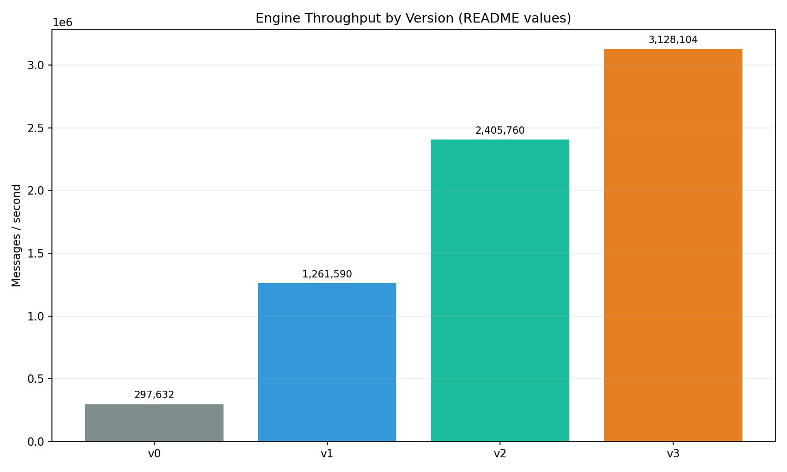
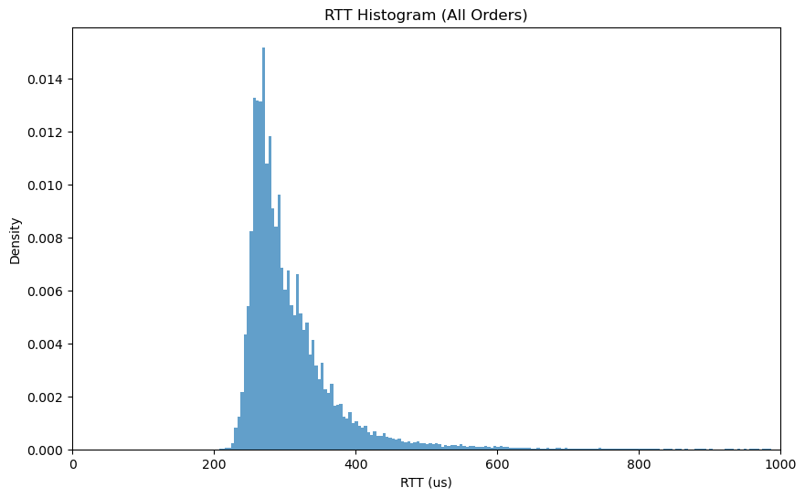
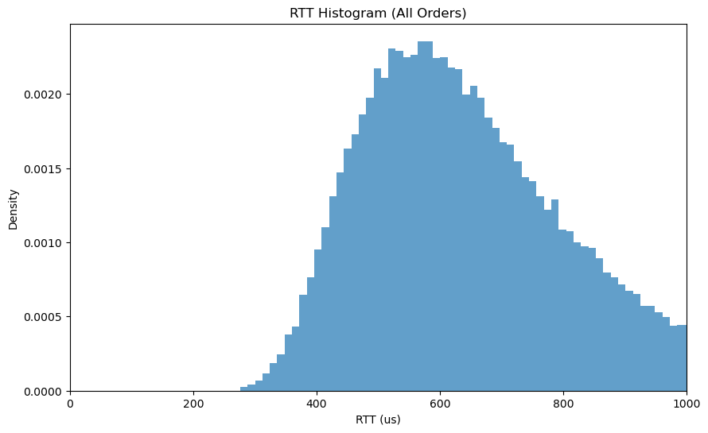
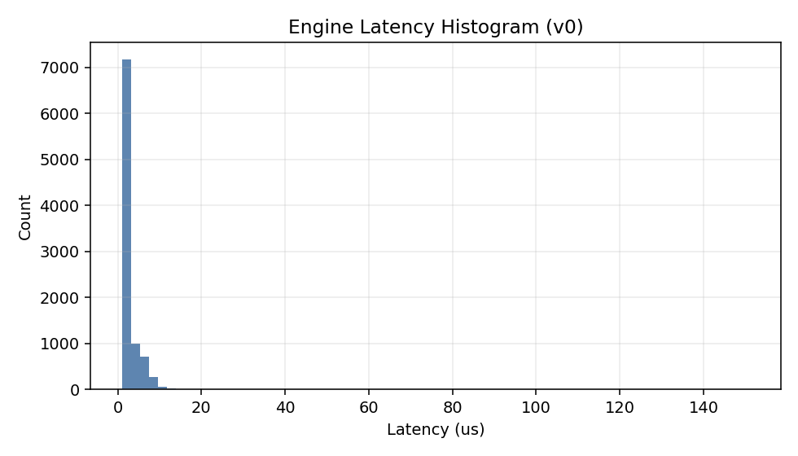
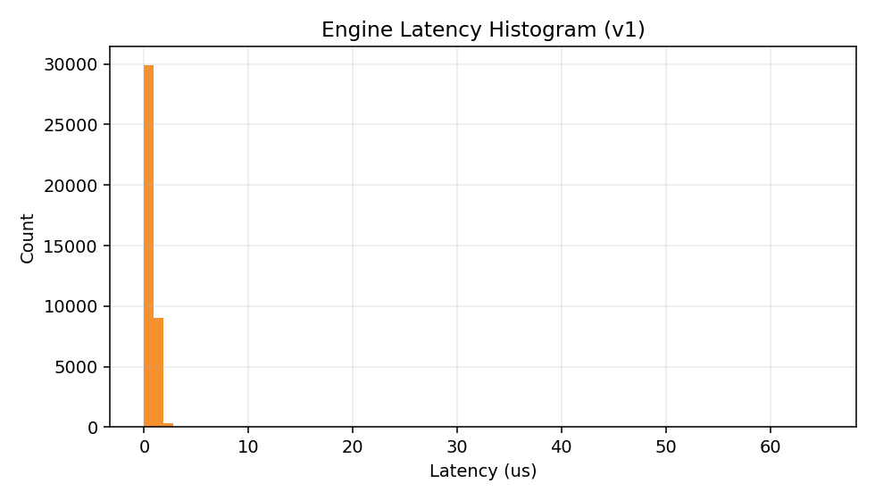
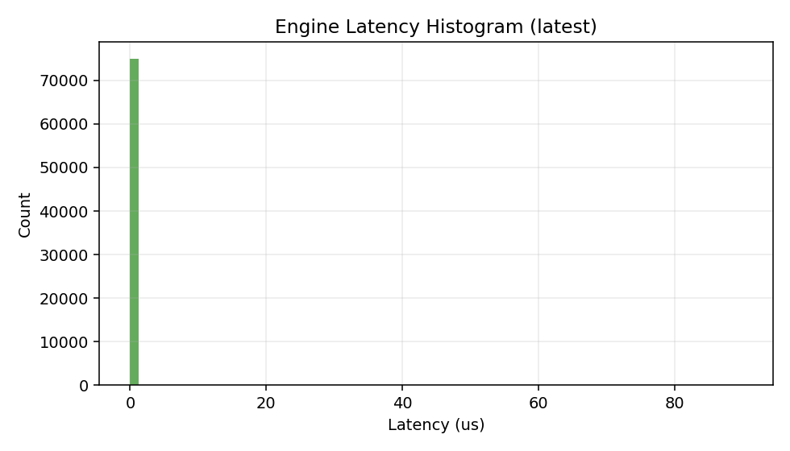
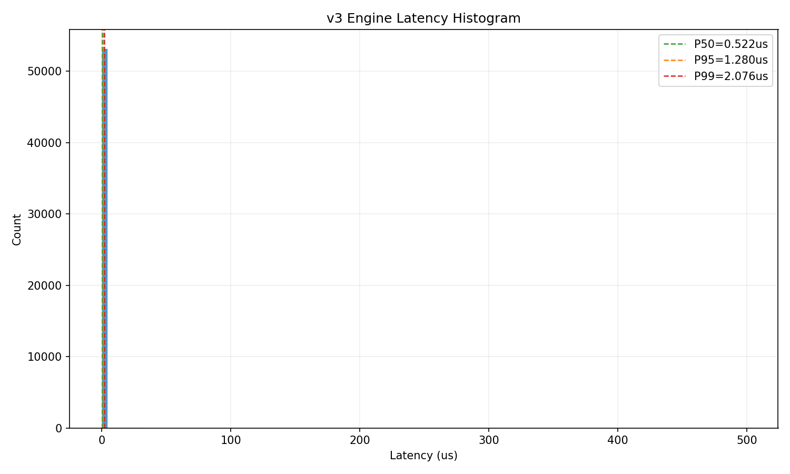
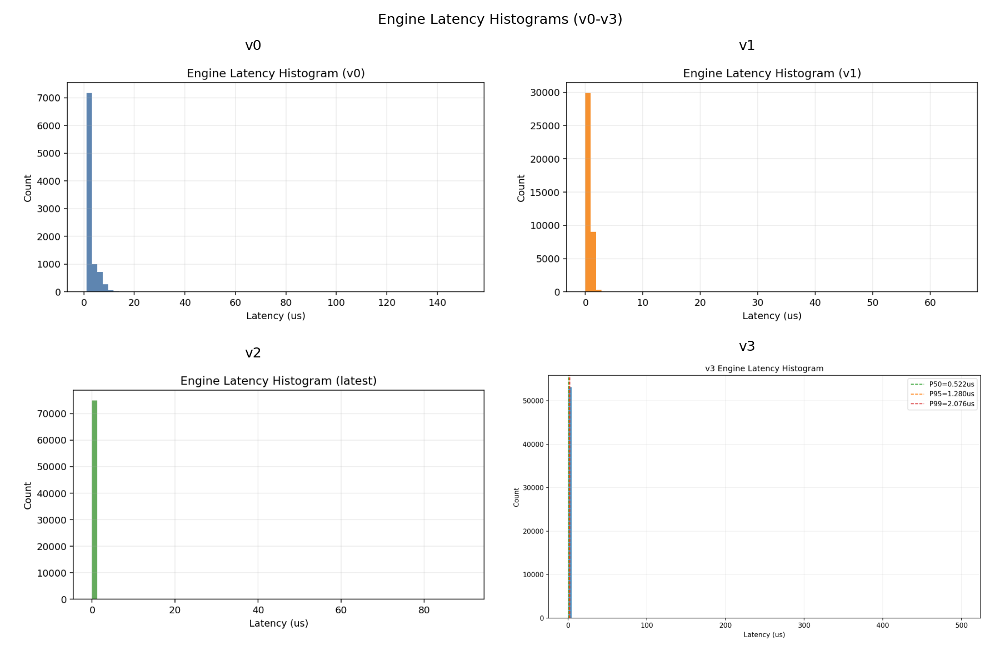

# Low-Latency Order Book Engine (C++)

This project is a research-style exploration of building a **low-latency order matching engine in C++**, mainly inspired from research such as [C++ Design Patterns for Low-Latency Applications including High-Frequency Trading](https://arxiv.org/pdf/2309.04259).

The goal is to implement a baseline order book engine, then iteratively apply optimizations and benchmark their impact on performance.  

All results and learnings will be documented here in detail.

## Windows Setup Guide

For a full Windows setup walkthrough (WSL install, Ubuntu setup, toolchain install, Bazel, Python packages, build, test, and run), see [README_windows_setup.md](README_windows_setup.md).

---

## Project Vision

- Build a **order book engine** that supports:
  - Limit Orders
  - Add / Modify / Cancel Orders
  - Order Matching
  - Trade Generation
- Support **simplified FIX 4.2 style orders** over TCP
- Client - Server architecture to simulate real-world order submission and acknowledgment
- Measure **Round Trip Time (RTT)** from order submission to acknowledgment
- Optimize aggressively with a focus on **nanosecond-level latency** and **throughput scaling**.
- Track and publish **performance improvements** at each iteration.

This project is meant as my pet project to learn **C++**, **systems-level thinking**, and **low-latency design tradeoffs**.

--- 

## Design

          +-----------------+
          |      Client     |
          | (FIX Orders)   |
          +--------+--------+
                   |
                   v
          +-----------------+
          |      Server     |
          | (Order Router)  |
          +--------+--------+
                   |
                   v
          +-----------------+
          | Order Book      |
          | Engine (C++)    |
          | - Add/Cancel    |
          | - Modify        |
          | - Match Orders  |
          | - Generate Trades|
          +--------+--------+
                   |
                   v
          +-----------------+
          |      Server     |
          | (ACK Response)  |
          +--------+--------+
                   |
                   v
          +-----------------+
          |      Client     |
          +-----------------+


Client sends FIX orders to Server -> Server processes orders through Order Book Engine -> Server returns line-delimited acknowledgments (`OK`, `ERR`, or `ID:<order_id>`).

**Round Trip Time** (RTT) is measured from Client order submission to Server acknowledgment.

Performance metrics such as **latency** (ns/op), **throughput** (orders/sec), and **memory usage** are tracked at each iteration.

---

## Tech Stack

- **Language**: C++20
- **Build**: Bazel
- **Testing**: Bazel `cc_test` (assert-style unit/integration test in `tests/orderbook_test.cpp`)
- **Benchmarking**:
  - Engine throughput benchmark (`src/main_engine_benchmark.cpp`)
  - End-to-end RTT workload from Python client (`py_client/client.py`) or built-in workload (`scripts/profile_server_perf.sh`)
- **Profiling**: Linux `perf` (with WSL-compatible fallback binary detection)

---

## Benchmarking Methodology

Current measurements in this repo use two complementary paths:

1. **Engine-only throughput path**
  - Run `//src:main_engine_benchmark` with a pre-generated FIX workload.
  - Measure processed messages and throughput (msgs/s).

2. **Server RTT path**
  - Run `//src:main_server` and drive traffic with either:
    - built-in workload in `scripts/profile_server_perf.sh`, or
    - custom client command (for example `python3 py_client/client.py`).
  - Measure end-to-end RTT and throughput under configurable concurrency/pipeline depth.

3. **Profiler path**
  - Run Linux `perf` sampling against the live server process.
  - Export symbol-level reports (`perf-report.txt`) for hotspot analysis.

---

## How to run it

### Build the Server:
```bash
bazel build //src:main_server
```

### Run the Server:
```bash
bazel run //src:main_server
```

### Run the Engine Benchmark:
```bash
bazel run //src:main_engine_benchmark -- 10 2000000
```

### Run the Tests:
```bash
bazel test //tests:orderbook_test
```

### Profile Server-Side Functions (Linux/WSL)

Use Linux `perf` to find hot functions inside the C++ server process.

1. Install perf (Ubuntu/WSL):
```bash
sudo apt-get update
sudo apt-get install -y linux-tools-common linux-tools-generic linux-cloud-tools-generic
```
On WSL, `linux-tools-$(uname -r)` often does not exist. The helper script auto-detects a usable perf binary under `/usr/lib/linux-tools/...`.

2. Run profiling with the helper script:
```bash
./scripts/profile_server_perf.sh 20 results/profile_run_01
```
This command now runs a built-in client workload automatically, so the server is actively exercised during profiling.

To control built-in load concurrency, pass `num_threads` as the 4th argument:
```bash
./scripts/profile_server_perf.sh 20 results/profile_run_01 "" 4
```

3. Read results:
- `results/profile_run_01/perf-report.txt` for hot functions
- `results/profile_run_01/server.log` for server runtime logs

---

## Versions of Orderbook Engine

This section tracks the engine evolution as a sequence of deliberate design decisions and measured outcomes.

### Benchmark context for fair interpretation
- v0 processes JSON messages (`processJsonMessage`) and does not use symbol-aware FIX routing.
- v1, v2, and v3 process FIX messages with symbols (`processFixMessage`).
- The protocol stack is therefore part of the measured latency/throughput, which reflects real pipeline cost rather than matching-only microbenchmarks.

### Engine-only benchmark summary (same harness settings)

Run settings:
- Duration: 8 seconds
- Pre-generated workload: 500,000 messages
- Latency sampling: every 256 messages

| Version | Protocol | Processed | Throughput (msgs/s) | Mean us | P50 us | P95 us | P99 us |
| --- | --- | ---: | ---: | ---: | ---: | ---: | ---: |
| v0 | JSON | 2,381,059 | 297,632 | 2.76 | 2 | 7 | 11 |
| v1 | FIX | 10,092,759 | 1,261,590 | 0.27 | 0 | 1 | 2 |
| v2 | FIX | 19,246,057 | 2,405,760 | 0.04 | 0 | 0 | 1 |
| v3 | FIX | 25,024,832 | 3,128,104 | 0.03 | 0 | 0 | 1 |

Relative throughput gains:
- v1 vs v0: 4.24x
- v2 vs v1: 1.91x
- v3 vs v2: 1.30x
- v3 vs v0: 10.50x

Summary plots from the table above:



### v0: Baseline (JSON)

What was implemented:
- Core order-book flow with add/modify/cancel/match/trade generation.
- Conventional STL-first design (`std::map`/`std::list`) and mutex-based synchronization.
- End-to-end client/server RTT measurement to establish a baseline envelope.

What profiling showed:
- High time share in JSON object construction/destruction plus allocator churn.
- Under server RTT tests, lock contention became visible under multi-thread load.

Interpretation:
- v0 is a useful correctness baseline, but protocol overhead and synchronization strategy limit headroom for low-latency goals.

Legacy RTT histograms (client/server path):




Engine-only latency histogram:



### v1: FIX + symbol-aware books (first major performance step)

What changed:
- Introduced simplified FIX ingestion and symbol-aware book routing.
- Added order ownership mapping for faster cancel/modify lookup.
- Shifted cost from JSON handling toward actual matching and order lifecycle logic.

What profiling showed:
- Hot path is now `processFixMessage`, `addOrder`, and `matchOrders`.
- Remaining overhead is mostly parsing, hash lookups, and allocation/free traffic.

Engine-only latency histogram:



### v2: allocator and locator-focused optimization

What changed:
- Introduced pooled order allocation (`OrderPool`) to reduce allocation overhead.
- Moved toward more cache-friendly lookup and locator behavior, vectors instead of unordered maps.
- Kept FIX+symbol architecture while tightening the hot path.

What profiling showed:
- Same primary hotspots (`processFixMessage`, `addOrder`, `matchOrders`), but improved work per cycle.
- Lower relative allocator pressure per message at materially higher throughput.

Interpretation:
- v2 is the strongest balance so far between maintainability and realistic low-latency behavior.
- The optimization direction is now aligned with HFT constraints: reduce dynamic allocation, simplify ownership lookups, and keep critical paths predictable.

Engine-only latency histogram:



### v3: parsing/string-formatting cleanup on the hot path

What changed:
- Simplified FIX parsing and response handling code paths to reduce repeated string handling branches in `processFixMessage`.
- Cleaned up FIX tag and response constant organization for tighter, easier-to-follow fast-path logic.
- Reduced temporary string work around request/response handling so the server spends more time in actual order processing.

What this optimization targets:
- Lower CPU overhead in message parse/response formatting work.
- Improve maintainability of the hot path while keeping behavior stable.

Engine-only latency histogram:



Combined histogram view:



---

## Future Ideas

- Evaluate a **single-writer per symbol (or symbol shard)** architecture so matching logic can run without mutexes on the hot path.
- Use **lock-free MPSC queues** at the boundary (network threads -> matching workers) instead of shared mutable state across threads.
- Keep ordering deterministic (price-time priority) by preserving strict in-thread sequencing for each shard.
- Compare this model against the current mutex design using the same benchmark harness and `perf` workflow.

---

## References

### C++ Resources
- [C++ Design Patterns for Low-Latency Applications including High-Frequency Trading](https://arxiv.org/pdf/2309.04259)
- Effective Modern C++ by Scott Meyers

### Data Sources
- [Binance WebSocket API Documentation](https://developers.binance.com/docs/binance-spot-api-docs/web-socket-streams)
- [Binance How to manage a local order book correctly](https://developers.binance.com/docs/derivatives/usds-margined-futures/websocket-market-streams/How-to-manage-a-local-order-book-correctly)
- [WebSocket API: Order Book](https://developers.binance.com/docs/derivatives/usds-margined-futures/market-data/websocket-api)

### Order Book Implementations
- Market Microstructure Theory, by Maureen O'Hara
- [OrderBook Repository by TheCodingJesus](https://github.com/Tzadiko/Orderbook/tree/master)

### AI Coding Assistants
- GitHub Copilot (Helped me improve from v1 to v3 with suggestions on allocator design and lookup optimizations)

---